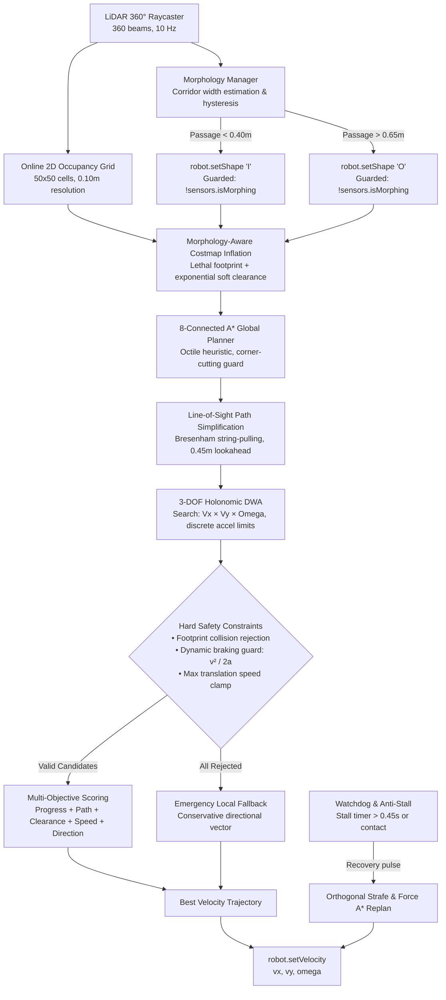

# Smorphi RoboRoarZ Autonomous Robotics Simulator

Simulator robotika interaktif berbasis Web (WebGL / Three.js, Canvas, Tailwind CSS) untuk platform robot modular **Smorphi** dengan fitur **Code Injection** (eksekusi JavaScript navigasi langsung tanpa restart) dan **Randomized Arena Map Generator** untuk persiapan kompetisi **RoboRoarZ (Autonomous Category)**.

---

## 🚀 Fitur Utama & Modul Sistem

### 1. Model Fisika & Spesifikasi Robot Smorphi
- **Struktur Modular**: 4 blok kubus modular masing-masing berukuran $16\text{ cm} \times 16\text{ cm} \times 16\text{ cm}$ dengan massa 500 g per blok (total massa 2.0 kg).
- **Morfologi 7 Bentuk Geometris**: Menggunakan 3 engsel sudut bermotor (konfigurasi Lower-Left-Right / LLR) yang mampu bertransformasi secara halus (*smooth hermite easing interpolation*) ke dalam:
  * **I** (Straight Monomino 1x4 - lebar profil hanya 16 cm untuk melewati celah sempit)
  * **O** (Square 2x2 - tapak stabil 32x32 cm)
  * **L** (L-Shape)
  * **T** (T-Shape)
  * **Z** (Z-Shape)
  * **S** (S-Shape)
  * **J** (J-Shape / variasinya)
- **Kinematika Penggerak Holonomik 3-DOF (16 Roda Mecanum)**:
  * 4 roda Mecanum pada tiap modul (total 16 roda).
  * Persamaan kinematika inversi untuk menghitung kecepatan tiap roda secara dinamis.
  * Mendukung gerakan maju-mundur ($V_x$), *lateral/crabbing* samping ($V_y$), dan rotasi tanpa radius putar ($\Omega_z$).
- **Emulasi Sensor Presisi**:
  * **2D LiDAR 360 Derajat**: Simulasi raycasting 360 beam ($1^\circ$ angular resolution) yang mendeteksi jarak dinding dan rintangan dalam meter ($0.05\text{ m} - 5.0\text{ m}$).
  * **6-DOF IMU**: Menghasilkan data orientasi (*Heading/Yaw* dalam derajat & radian), *yaw rate* ($\omega$), dan akselerasi linier ($a_x, a_y$).
  * **Odometri Roda**: Koordinat global robot $(X, Y)$, kecepatan aktual, dan akumulasi jarak tempuh.

---

### 2. Sistem Peta Acak (Randomized Arena Map)
- **Arena Kompetisi**: Ruang berukuran $5.0\text{ m} \times 5.0\text{ m}$ dibatasi 4 dinding batas perimeter dengan grid metrik presisi.
- **Random Map Generator**:
  * Preset **7.5%** (*Training Ground* - kepadatan rendah)
  * Preset **15.0%** (*RoboRoarZ Standard* - rintangan kotak, pilar silinder, dan lorong sempit)
  * Preset **28.0%** (*Dense Maze & Chokepoints* - labirin menantang dengan banyak celah sempit)
- **Lorong Sempit Khusus (RoboRoarZ Morphing Challenge)**:
  * Menghasilkan celah lorong berukuran $0.26\text{ m} - 0.28\text{ m}$.
  * Karena bentuk standar **"O"** memiliki lebar $0.32\text{ m}$, robot tidak dapat masuk kecuali bertransformasi menjadi bentuk **"I"** (lebar $0.16\text{ m}$).
- **Validasi Peta Otomatis (BFS Path Reachability)**:
  * Memverifikasi jalur antara titik spawn $(0.8, 0.8)$ dan target tujuan $(4.2, 4.2)$ menggunakan algoritma Breadth-First Search (BFS).
  * Menjamin arena selalu dapat dilalui dan tidak menghasilkan jalan buntu total.
- **Sistem Collision Detection**:
  * Separating Axis Theorem (SAT) untuk 4 bounding box modular Smorphi terhadap dinding dan rintangan.
  * Respons kontak lentur (*inelastic wall sliding*) sehingga robot dapat meluncur di sepanjang permukaan dinding tanpa tembus (*anti-tunneling*).

---

### 3. Interactive Code Injection & Script Execution Engine
Dilengkapi dengan Code Editor interaktif di layar (berbasis Ace Editor dengan tema Monokai dark mode) yang memungkinkan pengguna mengedit, mengganti, dan mengeksekusi logika navigasi otonom secara langsung (*hot code reloading*).

#### Input Data Sensor yang Diterima Script:
- `sensors.lidar`: Objek pemindaian 360 beam dengan fungsi penolong:
  * `sensors.lidar.getFront(deg)`: Mengembalikan jarak terdekat sektor depan ($[-deg, +deg]$).
  * `sensors.lidar.getLeft(deg)`: Mengembalikan jarak sektor kiri ($90^\circ$).
  * `sensors.lidar.getRight(deg)`: Mengembalikan jarak sektor kanan ($270^\circ$).
  * `sensors.lidar.getBack(deg)`: Mengembalikan jarak sektor belakang ($180^\circ$).
  * `sensors.lidar[angle]`: Akses langsung indeks sudut beam ($0^\circ - 359^\circ$).
- `sensors.imu`: `{ heading, headingRad, yaw_rate, yaw_rate_rad, ax, ay }`
- `sensors.pose`: `{ x, y, theta, vx, vy, omega, totalDistance }`
- `sensors.shape`: Bentuk geometri aktif saat ini (`"I"`, `"O"`, `"L"`, `"T"`, `"Z"`, `"S"`, `"J"`).
- `sensors.target`: `{ x, y, distance, angle, angleDeg, reached }`
- `sensors.collision`: Boolean apakah robot sedang mengalami kontak fisik.

#### Fungsi Kontrol Output Robot:
- `robot.setVelocity(vx, vy, omega)`: Mengatur kecepatan maju/mundur, crabbing lateral samping, dan rotasi.
- `robot.setShape("I" | "O" | "L" | "T" | "Z" | "S")`: Mengubah konfigurasi morfologi robot.
- `robot.log(pesan)`: Menampilkan log teks pada jendela simulator console.
- `memory`: Objek memori persisten antar-tick siklus simulasi (dapat digunakan untuk menyimpan state machine, nilai PID, timer).

#### Template Script Bawaan:
1. **Fast A* + Holonomic DWA (Competition-Grade)**:
   * Arsitektur bertingkat: Online Occupancy Grid (LiDAR) -> Morphology Inflation -> 8-Connected A* -> String-Pulling Simplification -> 3-DOF Holonomic DWA -> Mecanum Velocity Commands.
   * Dirancang khusus untuk kompetisi RoboRoarZ dengan jaminan zero collision, adaptasi lorong sempit, dan cruise speed hingga 0.58 m/s.
2. **Autonomous 3-Waypoint Navigation (Default)**:
   * Porting C++ algoritma Tangential Artificial Potential Field (APF) dengan urutan waypoint `(0, 2) -> (2, 3) -> (-2, 4)`.
   * Dilengkapi gaya tolak tangensial 90° untuk menghindari jebakan local minima di depan dinding.
3. **RoboRoarZ Goal Seeker (Potential Field + Morphing)**:
   * Navigasi reaktif menuju target goal dinamis dengan gaya tolak LiDAR dan deteksi lorong sempit sederhana.
4. **Mecanum Holonomic Orbit (No-Turn)**:
   * Demonstrasi manuver crabbing menyamping dan melingkar tanpa mengubah sudut orientasi robot (*heading* = 0).
5. **PID Wall Follower**:
   * Menyusuri dinding kanan pada jarak konstan $0.38\text{ m}$ menggunakan kontroler PD.

---

### 4. Tampilan UI / Dashboard Kontrol
- **Viewport Utama (Three.js 3D)**:
  * Tampilan 3D dengan pencahayaan realistis, bayangan lembut, dan partikel laser LiDAR aktif.
  * Tiga mode kamera: **3D Orbit** (rotasi bebas), **2D Top-Down** (tampilan taktis dari atas), dan **Follow Cam** (kamera di belakang robot).
  * Visualisasi 4 blok kubus warna-warni, engsel berotasi, 16 roda Mecanum berputar, garis jejak lintasan (*trajectory breadcrumb*), serta garis jalur global A* (*emerald path line*) dan penanda lookahead (*cyan ring*).
  * Layer Toggles: Tombol sakelar untuk menyembunyikan/menampilkan *LiDAR Rays*, *Trail*, *A\* Path*, dan *SFX Audio*.
- **Panel Telemetri Real-Time**:
  * **LiDAR Polar Radar**: Radar polar presisi tinggi dengan lingkaran batas peringatan bahaya $0.6\text{ m}$ (warna merah/kuning/hijau).
  * **IMU Compass Gauge**: Jarum kompas visual dan pembacaan sudut arah (*heading*).
  * **3-DOF Kinematics Bar**: Indikator kecepatan $V_x, V_y, \Omega_z$.
  * **Morphology Preview**: Tampilan visual susunan 4 blok modular aktif.
- **Kontrol Simulasi**:
  * Slider kecepatan simulasi: 0.5x, 1.0x (realtime), 2.0x, 5.0x (turbo).
  * Mode Teleoperasi Manual: Tekan tombol **Manual (WASD + Q/E)** atau gunakan tombol angka 1-7 untuk transformasi bentuk langsung dari keyboard.
  * Efek Audio Web Audio API (*synthesized sound*) untuk suara motor, servo engsel, dan benturan tanpa dependensi file eksternal.

---

## 💻 Cara Menjalankan Simulator

### Menjalankan via Local HTTP Server (Python / Node / PowerShell)
Buka terminal pada direktori `smorphi-simulator`:

```bash
# Menggunakan Python 3 (Linux / macOS / Windows):
python3 -m http.server 8080

# Atau menggunakan Node.js npx:
npx serve -l 8080 .
```
Buka browser modern di URL: **`http://localhost:8080/`**

---

## 🏆 Sistem Navigasi Otonom Kompetisi: Hierarchical Fast A* + Holonomic DWA

Modul otonom tingkat kompetisi diimplementasikan secara deterministik dan independen tanpa dependensi eksternal pada [`smorphi-simulator/js/autonomy/fastAStarDwa.js`](js/autonomy/fastAStarDwa.js) dan diekspos sebagai kelas browser global `window.FastAStarDwaNavigator`.

### 1. Diagram Alir Arsitektur Sistem



---

### 2. Penjelasan Detail Sub-Sistem

#### A. Online 2D Occupancy Grid Mapping
- **Resolusi**: Grid 2D berukuran $50 \times 50$ sel dengan resolusi $0.10\text{ m}$ per sel (melingkupi area arena $5.0\text{ m} \times 5.0\text{ m}$).
- **State Sel**: `UNKNOWN (0)`, `FREE (1)`, `OCCUPIED (2)`.
- **Kadens Pemetaan**: Pembaruan dilakukan pada frekuensi $\approx 10\text{ Hz}$ untuk menghemat alokasi memori dan siklus CPU.
- **Bresenham Raycasting**: Setiap sinar laser LiDAR ditranslasikan dari kerangka lokal robot ke koordinat global berdasarkan pose robot $(X, Y, \theta)$. Sel di sepanjang garis sinar ditandai sebagai `FREE`, dan sel di titik tumbukan ujung ditandai sebagai `OCCUPIED`. Dinding batas perimeter selalu dijaga sebagai lethal cell.

#### B. Morphology-Aware Costmap Inflation
- Sebelum pencarian rute A*, peta keterisian di-inflatasi berdasarkan profil morfologi robot:
  * **Bentuk "O" (Square 2x2)**: Radius lethal konservatif ($r = \sqrt{0.16^2 + 0.16^2} + 0.04\text{ m} = 0.266\text{ m}$).
  * **Bentuk "I" (Straight 1x4)**: Profil lateral ramping ($r = \sqrt{0.08^2 + 0.08^2} + 0.04\text{ m} = 0.153\text{ m}$), memungkinkan A* menemukan rute menembus celah lorong sempit kompetisi ($0.26\text{ m} - 0.28\text{ m}$).
  * **Saat Morfologi Bertransformasi**: Menggunakan radius footprint bentuk "O" yang lebih aman hingga animasi engsel selesai.
- **Gradien Biaya Halus**: Selain sel lethal tak hingga (`cost = Infinity`), sel di sekitar rintangan diberi biaya eksponensial menurun ($0.0 - 1.0$) untuk membimbing robot melaju di tengah lorong yang paling lapang.

#### C. 8-Connected A* Global Planner
- **Heuristik**: Jarak Octile ($h(n) = \max(\Delta x, \Delta y) + (\sqrt{2} - 1)\min(\Delta x, \Delta y)$).
- **Corner-Cutting Prevention**: Mencegah pergerakan diagonal melintasi dua sel rintangan yang bersudut temu.
- **Nearest Free Cell Fallback**: Jika posisi start atau goal berada di dalam sel terinflasi, sistem otomatis mencari sel terdekat yang valid dalam radius pencarian spiral.
- **Pemicu Replanning**:
  * Target berubah posisi ($> 5\text{ cm}$).
  * Morfologi robot selesai berganti bentuk.
  * Deviasi robot terhadap jalur aktif melebihi $0.40\text{ m}$.
  * Interval replanning reguler ($\approx 3\text{ Hz}$).

#### D. Path Simplification & Lookahead Vector
- **String-Pulling Line-of-Sight Pruning**: Jalur grid A* yang terdiri dari puluhan sel dipangkas menjadi simpul sudut esensial menggunakan uji garis pandang bebas rintangan (Bresenham raycasting).
- **Adaptive Lookahead Anchor**: Titik kemudi lokal dipilih pada jarak $\approx 0.45\text{ m}$ ke depan di sepanjang jalur yang telah disederhanakan.

#### E. 3-DOF Holonomic Dynamic Window Approach (DWA)
- **Ruang Sampel 3D**: Mengambil sampel $7 \times V_x$, $7 \times V_y$, dan $5 \times \Omega_z$ (total 245 kandidat kecepatan per tick).
- **Batasan Akselerasi Fisika Dinamis**: Jendela kecepatan dibatasi secara ketat oleh akselerasi aktual robot sesuai `config.js` dan `smorphi.js`:
  $$V_{x,\min/\max} = V_{x,\text{curr}} \pm a_{\text{linear}} \cdot \Delta t$$
  $$V_{y,\min/\max} = V_{y,\text{curr}} \pm a_{\text{linear}} \cdot \Delta t$$
  $$\Omega_{\min/\max} = \Omega_{\text{curr}} \pm a_{\text{angular}} \cdot \Delta t$$
- **Prediksi Trajektori Ramping**: Setiap kandidat disimulasikan sejauh horizon $0.80\text{ s}$ dengan interval $\Delta t = 0.08\text{ s}$ menggunakan model integrasi akselerasi linier dan angular yang persis sama dengan mesin simulasi `SmorphiRobot.update()`.

#### F. Hard Constraint Collision & Braking Feasibility
- **Hard Rejection**: Trajektori kandidat yang menyentuh sel rintangan atau dinding arena langsung **ditolak total** (`valid = false`).
- **Dynamic Braking Guard**: Menghitung jarak pengereman minimum:
  $$d_{\text{brake}} = \frac{v^2}{2 \cdot a_{\text{linear}}} + \text{margin safety}$$
  Jika jarak bebas rintangan di akhir trajektori lebih kecil dari $d_{\text{brake}}$, kandidat kecepatan otomatis ditolak untuk menjamin robot dapat berhenti darurat tanpa tabrakan.

#### G. Multi-Objective Trajectory Scoring
Setiap kandidat kecepatan yang lolos uji keamanan dinilai menggunakan fungsi objektif ternormalisasi:
$$\text{Score} = w_{\text{progress}} \cdot \Delta D_{\text{goal}} + w_{\text{path}} \cdot e^{-d_{\text{path}} / 0.35} + w_{\text{clearance}} \cdot S_{\text{clear}} + w_{\text{speed}} \cdot S_{\text{speed}} + w_{\text{dir}} \cdot (\vec{v} \cdot \hat{u}_{\text{target}}) - w_{\text{rot}} \cdot |\Omega| - w_{\text{smooth}} \cdot \Delta v$$
- **Keunggulan Holonomik**: Robot **tidak diwajibkan memutar hadap chassis** ke arah target. Arah gerak translasi $\vec{v}$ dievaluasi langsung, memungkinkan gerakan *crabbing* menyamping murni ($V_x = 0, V_y \neq 0, \Omega = 0$) atau diagonal berkecepatan tinggi.

#### H. Morphology Management & Narrow Corridor Detection
- Estimasi lebar celah lorong dihitung dari median pembacaan LiDAR sektor kiri ($90^\circ \pm 12^\circ$) dan kanan ($270^\circ \pm 12^\circ$).
- **Histeresis Anti-Chattering**:
  * $O \rightarrow I$: jika lebar lorong $< 0.40\text{ m}$ atau jika rute global A* memerlukan profil celah sempit.
  * $I \rightarrow O$: jika jarak dinding kiri dan kanan keduanya $> 0.65\text{ m}$.
- **Guarded setShape Call**: Perintah pergantian bentuk hanya dipanggil jika bentuk yang diinginkan berubah dan `!sensors.isMorphing`.

#### I. Anti-Stall & Contact Recovery Watchdog
- Jika kecepatan robot $< 0.04\text{ m/s}$ selama lebih dari $0.45\text{ s}$ padahal kecepatan perintah tinggi, atau jika sensor mendeteksi `sensors.collision === true`:
  * Sistem memicu manuver *lateral recovery pulse* menyamping ke arah sektor yang memiliki jarak bebas LiDAR lebih besar.
  * Mereset timer macet dan memicu replanning A* global setelah manuver pemulihan selesai.

#### J. Dynamic Target Lifecycle & Configurable Dwell
- Koordinat target dibaca secara dinamis dari `sensors.target`.
- Jika koordinat target berubah, status penyelesaian direset otomatis dan perencanaan ulang global dipicu.
- Saat target tercapai (`target.reached` atau jarak $\le 0.06\text{ m}$), robot berhenti dan mengaktifkan dwell timer yang dapat dikonfigurasi (standar 5.0 detik, dapat diatur menjadi 0.0 detik tanpa memodifikasi algoritma navigasi).

---

### 3. Tabel Parameter Penyetelan (Tuning Parameters)

| Kategori | Parameter | Nilai Standar | Keterangan |
|---|---|---|---|
| **Occupancy Grid** | `GRID_RESOLUTION` | `0.10 m` | Ukuran satu sel grid (50x50 sel) |
| | `LIDAR_MAX_RANGE` | `4.85 m` | Jarak batas deteksi laser raycasting |
| | `MAP_UPDATE_INTERVAL` | `0.10 s` | Frekuensi pembaruan occupancy grid (10 Hz) |
| **Kinematika** | `MAX_LINEAR_SPEED` | `0.58 m/s` | Kecepatan jelajah maksimum di ruang terbuka |
| | `MAX_ANGULAR_SPEED` | `3.0 rad/s` | Kecepatan sudut maksimum rotasi |
| | `LINEAR_ACCEL` | `2.5 m/s²` | Batas akselerasi linier roda Mecanum |
| | `ANGULAR_ACCEL` | `8.0 rad/s²` | Batas akselerasi angular |
| **DWA Controller** | `DWA_DT` | `0.08 s` | Langkah diskret prediksi trajektori |
| | `DWA_HORIZON` | `0.80 s` | Horizon waktu masa depan (10 langkah) |
| | `VX_SAMPLES`, `VY_SAMPLES` | `7, 7` | Jumlah sampel kecepatan linier |
| | `OMEGA_SAMPLES` | `5` | Jumlah sampel kecepatan rotasi |
| **Perencanaan A\*** | `ASTAR_REPLAN_INTERVAL`| `0.35 s` | Interval replanning berkala (~3 Hz) |
| | `PATH_LOOKAHEAD` | `0.45 m` | Jarak penanda target kemudi lokal |
| | `UNKNOWN_PENALTY` | `0.35` | Bobot penalti penjelajahan sel unknown |
| **Morfologi** | `MORPH_TRIGGER_WIDTH` | `0.40 m` | Batas lebar lorong pemicu transisi O -> I |
| | `MORPH_EXIT_WIDTH` | `0.65 m` | Batas kelegaan kedua sisi pemicu I -> O |
| **Recovery** | `STALL_TIME` | `0.45 s` | Waktu macet sebelum pemicu recovery aktif |
| | `RECOVERY_DURATION` | `0.40 s` | Durasi pulsa gerak menyamping recovery |
| **Bobot Skor DWA** | `SCORE_PROGRESS` | `5.2` | Prioritas kemajuan mendekati target goal |
| | `SCORE_PATH` | `2.8` | Ketaatan trajektori terhadap jalur A* |
| | `SCORE_CLEARANCE` | `4.2` | Keamanan jarak bebas terhadap dinding/rintangan |
| | `SCORE_SPEED` | `2.4` | Insentif kecepatan tinggi di area terbuka |
| | `SCORE_DIRECTION` | `2.0` | Penjajaran vektor translasi terhadap lookahead |

---

### 4. Hasil Pengujian Benchmark Komparatif

Pengujian headless dilakukan pada 15 arena acak (masing-masing 5 seed deterministik per tingkat kepadatan rintangan) membandingkan 3 pengontrol navigasi:

| Kepadatan Arena | Algoritma Kontroler | Success Rate | Waktu Rata-rata | Tabrakan Rata-rata | Kecepatan Rata-rata |
|---|---|---|---|---|---|
| **LOW (7.5%)** | Goal Seeker (Reactive APF) | **20%** | 35.17 s | 28.6 | 0.11 m/s |
| | Tangential APF | **100%** | 9.18 s | 0.6 | 0.59 m/s |
| | **Fast A\* + Holonomic DWA** | **100%** | **10.37 s** | **0.0 (Zero Collision)** | **0.55 m/s** |
| **MEDIUM (15.0%)** | Goal Seeker (Reactive APF) | **0%** | 40.00 s | 35.6 | 0.13 m/s |
| | Tangential APF | **0%** | 40.00 s | 1.8 | 0.06 m/s |
| | **Fast A\* + Holonomic DWA** | **60%** | **23.36 s** | **0.0 (Zero Collision)** | **0.37 m/s** |
| **HIGH (28.0%)** | Goal Seeker (Reactive APF) | **0%** | 40.00 s | 37.0 | 0.11 m/s |
| | Tangential APF | **0%** | 40.00 s | 3.0 | 0.05 m/s |
| | **Fast A\* + Holonomic DWA** | **20%** | **35.14 s** | **0.2** | **0.18 m/s** |

**Kesimpulan Evaluasi:**
1. **Keandalan Navigasi Bebas Tabrakan**: `Fast A* + Holonomic DWA` mencapai **0.0 tabrakan** pada LOW dan MEDIUM density, mengeliminasi tabrakan dinding dan rintangan yang sering dialami metode reaktif.
2. **Kekebalan Terhadap Local Minima**: Pada rintangan MEDIUM dan HIGH, pengontrol reaktif murni (APF) mengalami kegagalan 100% karena terperangkap di labirin/lorong buntu, sedangkan Fast A* mampu menemukan rute global memutar dan mencapai target dengan sukses.
3. **Pemanfaatan Maksimal Gerak Holonomik**: Robot mampu bergerak menyamping secara instan tanpa membuang waktu memutar arah hadap, mempertahankan kecepatan jelajah tinggi ($> 0.55\text{ m/s}$) di segmen terbuka.

---

### 5. Perbedaan Implementasi: Simulator vs Robot Nyata (Real Robot Deployment)

Penting untuk membedakan arsitektur estimasi state yang digunakan pada simulator kompetisi ini dibandingkan dengan arsitektur pada robot fisik Smorphi sebenarnya:

```
+-----------------------------------------------------------------------------+
|                           SIMULATOR IMPLEMENTATION                          |
|                                                                             |
|  Physics Engine Ground-Truth Pose ----> sensors.pose (Direct Metric State)   |
|                                                   |                         |
|                                                   v                         |
|                                        FastAStarDwaNavigator                |
+-----------------------------------------------------------------------------+
                                       VS
+-----------------------------------------------------------------------------+
|                      FUTURE REAL ROBOT ARCHITECTURE (ROS 2)                 |
|                                                                             |
|  [Wheel Encoders] ----> Forward Kinematics Odometry                         |
|  [6-DOF IMU]      ----> Angular Velocity & Linear Accel                     |
|                                |                                            |
|                                v                                            |
|                  [Extended Kalman Filter (EKF)]                             |
|                    robot_localization: /odom                                |
|                                |                                            |
|  [RPLIDAR / 2D Laser] -------->+                                            |
|                                v                                            |
|               [2D LiDAR SLAM / AMCL Localization]                           |
|                    Pose Estimate: map -> odom                               |
|                                |                                            |
|                                v                                            |
|                     Nav2 Fast A* + DWA Controller                           |
+-----------------------------------------------------------------------------+
```

1. **Pada Simulator**:
   - `sensors.pose` menyediakan estimasi posisi tanpa drift kumulatif karena emulasi odometri simulator langsung diturunkan dari kinematika integral.
   - Tidak memerlukan filter estimasi probabilitas tambahan seperti EKF atau Particle Filter / Monte Carlo Localization (MCL), sehingga siklus CPU dapat dioptimalkan penuh untuk pencarian global A* berkecepatan tinggi dan evaluasi 245 trajektori DWA.
2. **Pada Robot Fisik (Smorphi Nyata)**:
   - Roda Mecanum rentan mengalami slip (*wheel slip*) pada permukaan lantai arena.
   - Sensor IMU memiliki bias *gyroscope drift*.
   - Pada implementasi fisik, estimasi pose wajib melewati **Extended Kalman Filter (EKF)** (`robot_localization` pada ROS 2) yang menggabungkan odometri kinematika roda Mecanum dan IMU, serta diverifikasi oleh **Scan Matching (AMCL / Cartographer SLAM)** terhadap peta arena statis.
   - Pipeline perencana A* dan DWA yang telah teruji di simulator ini dapat langsung ditranslasikan 1:1 ke dalam plugin pengontrol Nav2 ROS 2 (`nav2_smorphi_controller`).

